# homework5

> 由于本地安装依赖比较慢，而且出现各种导包错误，所以后面选择使用codespace运行TensorFlowLite，（google的codelab用的时候在导包时导了40多G然后磁盘溢出了，有点奇怪，后面选择用codespace）


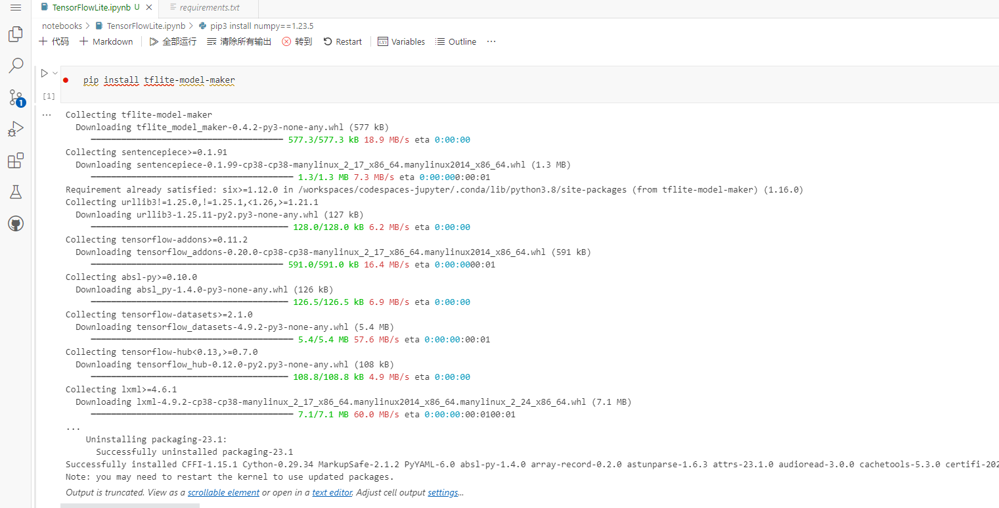

重启内核，然后运行下面代码：

```python
import os

import numpy as np

import tensorflow as tf
assert tf.__version__.startswith('2')

from tflite_model_maker import model_spec
from tflite_model_maker import image_classifier
from tflite_model_maker.config import ExportFormat
from tflite_model_maker.config import QuantizationConfig
from tflite_model_maker.image_classifier import DataLoader

import matplotlib.pyplot as plt
```

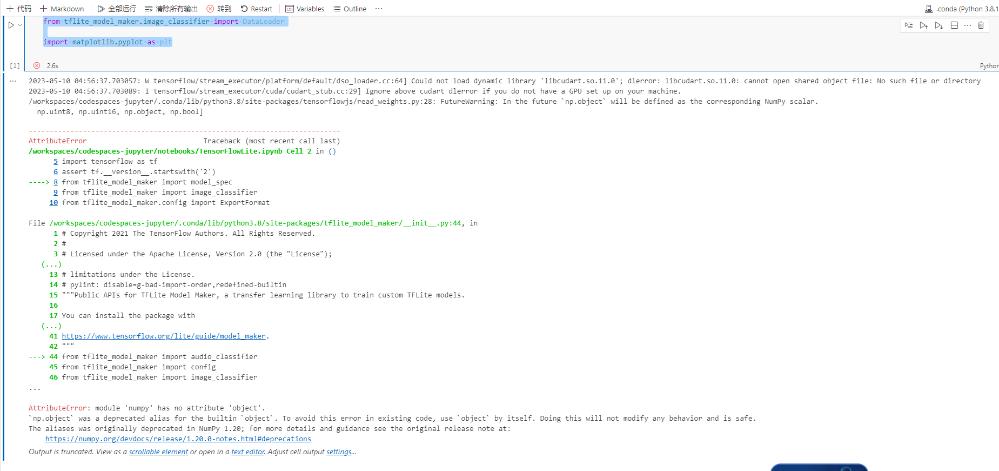

发现报错如上：问题是numpy版本过新，修改一下版本[参考地址](https://stackoverflow.com/questions/75069062/module-numpy-has-no-attribute-object)

```
pip install numpy==1.23.5
```

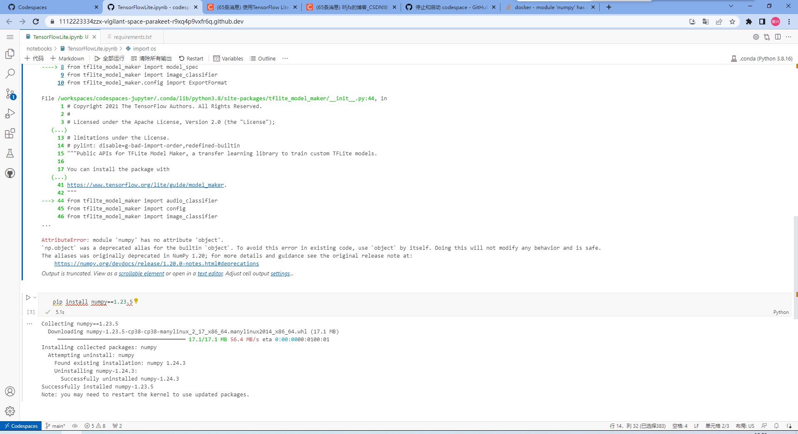

在运行导包代码：

发现缺少该文件

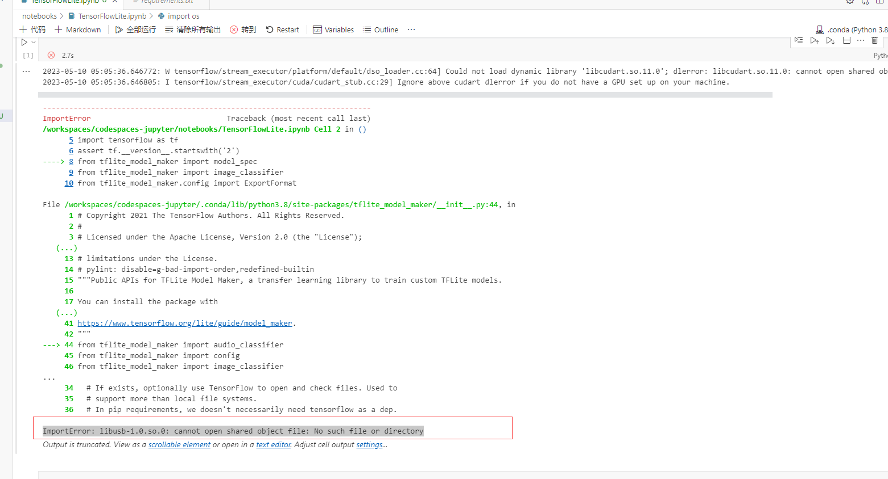

在终端输入以下内容：

```py
sudo apt-get -y install libusb-1.0-0-dev
```


如果发生以下报错：

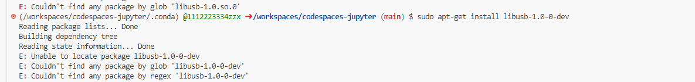

更新一下apt：

```
sudo apt-get update
```

在执行：

```
sudo apt-get -y install libusb-1.0-0-dev
```

之后在重新运行

```python
import os

import numpy as np

import tensorflow as tf
assert tf.__version__.startswith('2')

from tflite_model_maker import model_spec
from tflite_model_maker import image_classifier
from tflite_model_maker.config import ExportFormat
from tflite_model_maker.config import QuantizationConfig
from tflite_model_maker.image_classifier import DataLoader

import matplotlib.pyplot as plt
```

导包成功！

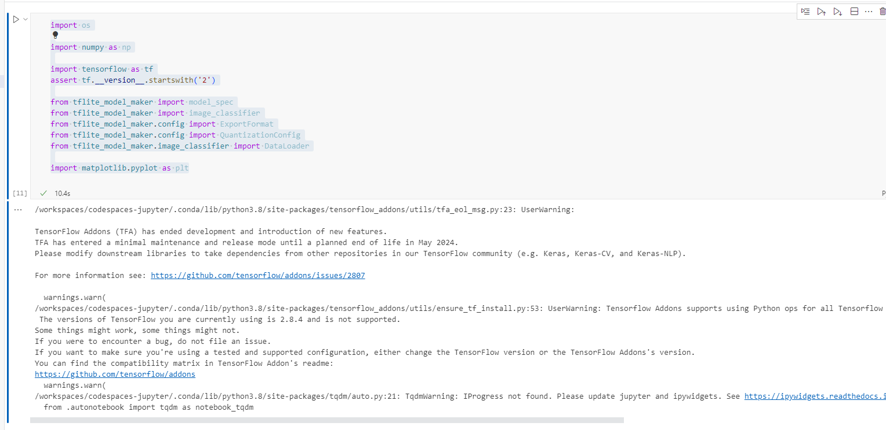

## 获取数据集：

```python
image_path = tf.keras.utils.get_file(
      'flower_photos.tgz',
      'https://storage.googleapis.com/download.tensorflow.org/example_images/flower_photos.tgz',
      extract=True)
image_path = os.path.join(os.path.dirname(image_path), 'flower_photos')

```

这里从`storage.googleapis.com`中下载了本实验所需要的数据集。`image_path`可以定制，默认是在用户目录的`.keras\datasets`中。

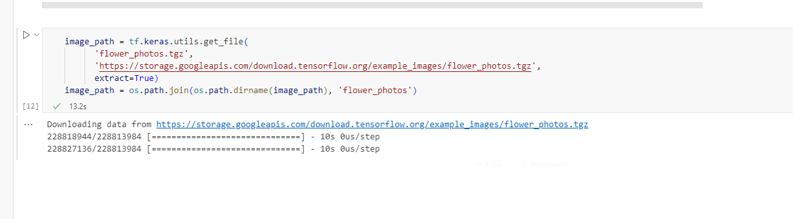

## 运行示例

一共需4步完成。
第一步：加载数据集，并将数据集分为训练数据和测试数据。

```
data = DataLoader.from_folder(image_path)
train_data, test_data = data.split(0.9)

```

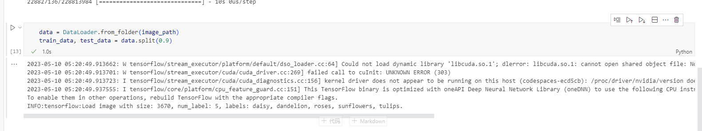

第二步：训练Tensorflow模型

```
model = image_classifier.create(train_data)

```


第三步：评估模型

```
loss, accuracy = model.evaluate(test_data)
```

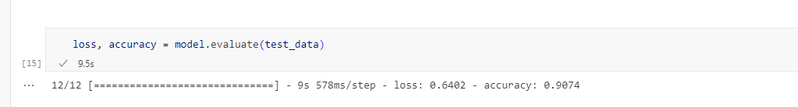

第四步，导出Tensorflow Lite模型

```
model.export(export_dir='.')
```

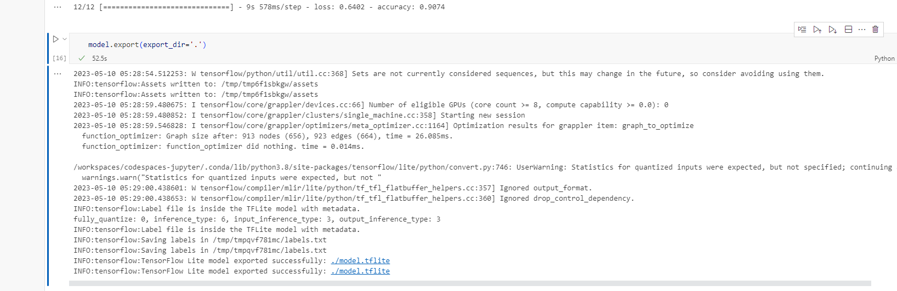

这里导出的Tensorflow Lite模型包含了元数据(metadata),其能够提供标准的模型描述。导出的模型存放在Jupyter Notebook当前的工作目录中。

导出结果如下：

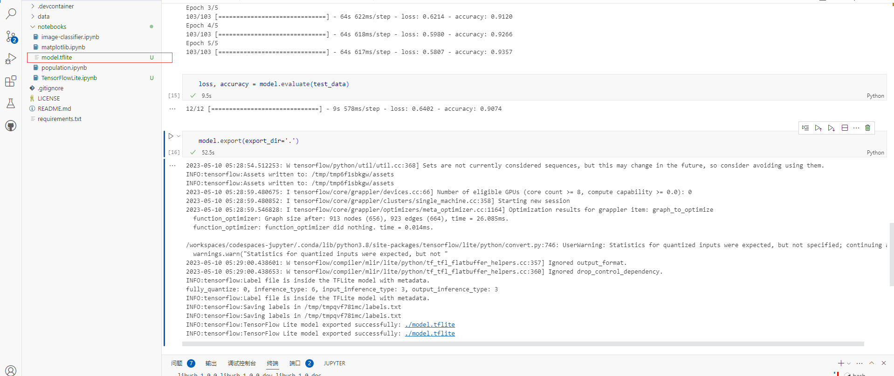

可以将该模型作为训练模型放入到实验四当中

右键->下载  将训练好的模型下载到本地

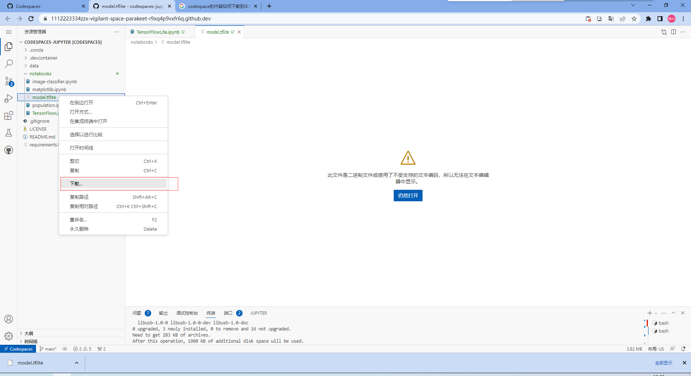

打开android Studio，将原本的FlowerModel删掉

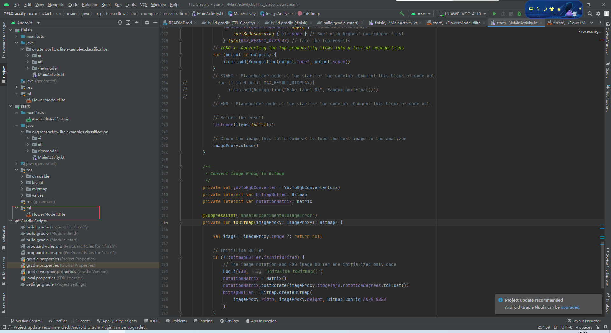

然后将刚训练好的模型导入

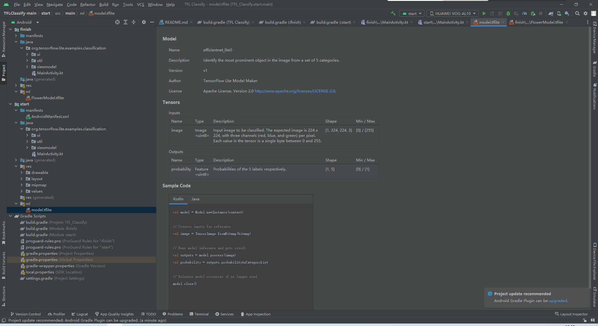

然后运行实体机，识别向日葵：

运行结果如下：

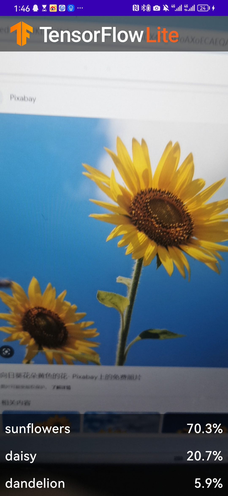

